<div align="center">



<br/><br/>

<a href="https://linkedin.com/in/guru-prasaath-d-3b16722b6"></a>&nbsp;
<a href="https://guruprasaathd.netlify.app/"></a>&nbsp;
<a href="mailto:guruprasaath.dilli@gmail.com"></a>


</div>

<br/>

## About



```swift
struct GuruPrasaath: Engineer {
    let base       = "Chennai, India"
    let education  = Degree(.btech, major: "CSE (Data Science)", at: "SRM IST", graduating: 2027)
    let experience = [Role("Software Engineering Intern", at: "Infosys, Mysore", period: "Jan–Feb 2026")]
    let leadership = ["President, Data Science Club", "President, DSBS Association"]

    var building: [Skill] { [.agenticAI, .rag, .java, .springBoot, .swiftUI] }
    var shipped:  [App]   { [.liveOnTheAppStore] }
    var offline:  [Hobby] { [.cricket, .movies, .music] }
}
```

<br/>

## On my home screen

<div align="center">

<sub>Languages</sub><br/>


<sub>AI and ML</sub><br/>


<sub>Backend and web</sub><br/>


<sub>Data and tools</sub><br/>


<br/><br/>


</div>

<br/>

## GitHub activity

<div align="center">


<picture>
  <source media="(prefers-color-scheme: dark)" srcset="https://raw.githubusercontent.com/Guru-Prasaath/Guru-Prasaath/output/github-snake-dark.svg"/>
  <source media="(prefers-color-scheme: light)" srcset="https://raw.githubusercontent.com/Guru-Prasaath/Guru-Prasaath/output/github-snake.svg"/>
  
</picture>

</div>

<br/>

## Say hello

<div align="center">

<a href="mailto:guruprasaath.dilli@gmail.com"></a>

<sub>Open to fresher roles in backend and applied AI engineering from 2027. Fastest reply: guruprasaath.dilli@gmail.com</sub>

</div>
